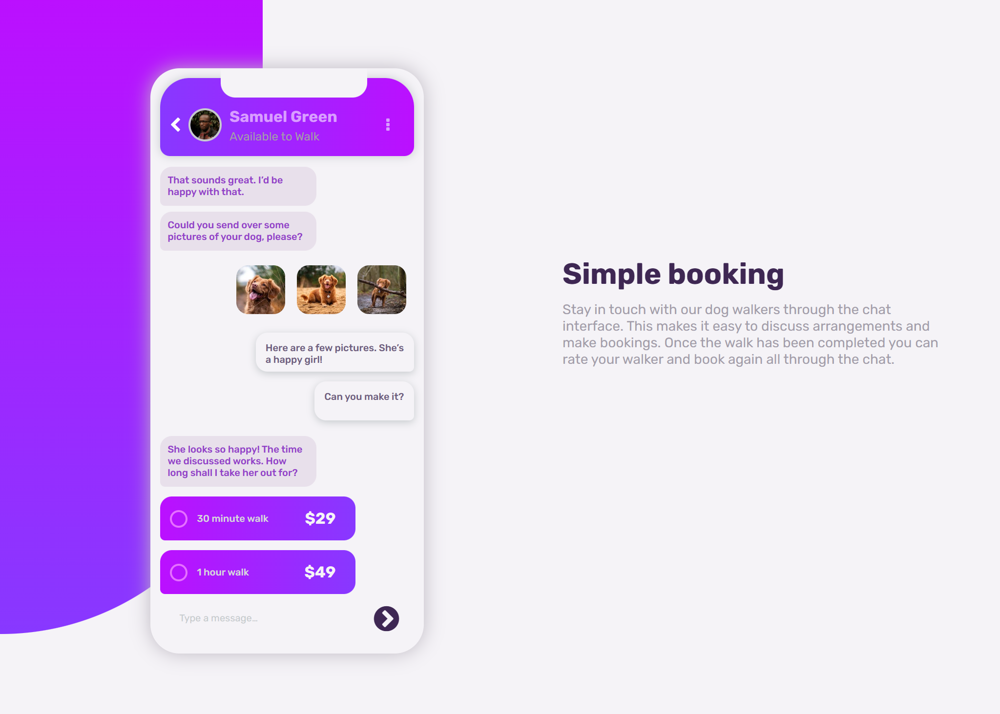

# Frontend Mentor - Chat app CSS illustration solution

This is a solution to the [Chat app CSS illustration challenge on Frontend Mentor](https://www.frontendmentor.io/challenges/chat-app-css-illustration-O5auMkFqY). Frontend Mentor challenges help you improve your coding skills by building realistic projects.

## Table of contents

- [Overview](#overview)
  - [The challenge](#the-challenge)
  - [Screenshot](#screenshot)
  - [Links](#links)
- [My process](#my-process)
  - [Built with](#built-with)
- [Author](#author)

## Overview

### The challenge

Users should be able to:

- View the optimal layout for the component depending on their device's screen size

### Screenshot

| Small-Screen-View                         | Large-Screen-View                           |
| ----------------------------------------- | ------------------------------------------- |
|  |  |

### Links

- Solution URL: [ solution URL ](https://github.com/ABU-BAKAR-S/Frontend-Mentor-Chat-App-Illustrator)
- Live Site URL: [ live site URL ](https://abu-bakar-s.github.io/Frontend-Mentor-Chat-App-Illustrator/)

## My process

### Built with

- Semantic HTML5 markup
- CSS custom properties
- Flexbox
- Mobile-first workflow

## Author

- Frontend Mentor - [Abu Bakar Siddik](https://www.frontendmentor.io/profile/ABU-BAKAR-S)
